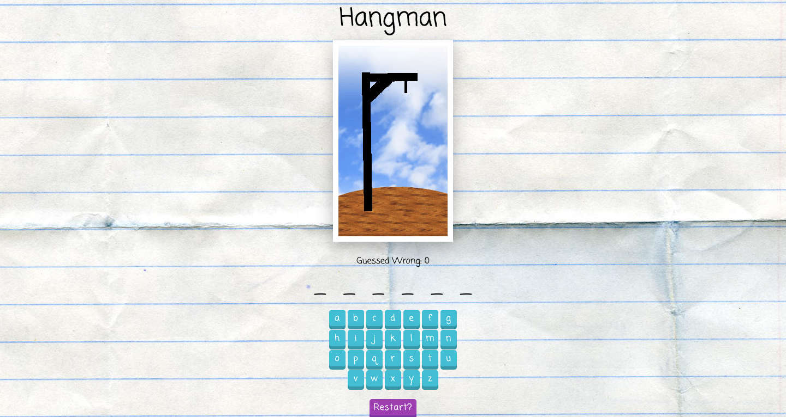

# Hangman - This is an exercise project that lets you pratice with props, defaultProps, state, and simple click events and a lot more in React.

[RollDice](https://youthful-lamport-b37d73.netlify.com/) is the classic hangman game built as an exercise for this [tutorial](https://www.udemy.com/course/modern-react-bootcamp/).



## Table of content

- [Description](#description)
- [Installation](#installation)
- [Contact](#contact)

## Description

The rules of the exercise are as follows

### Part One: Add A Key

Currently, the buttons don’t have a key prop. Fix this issue!

### Part Two: Number of Wrong Guesses

Above the currently-guessed word, we’d like to show the number of wrong guesses, like “Number wrong: 3.” Add this.

### Part Three: End Game on Loss

The game only comes (by default) with 6 gallows images and therefore should only allow six wrong guesses. However, it allows players to keep making guesses after this (and there’s a bug, in that the gallows images disappears after there are too many wrong).

### Change the behavior of the game so that after six wrong guesses, it no longer shows the button area. Instead, it should show the message “You lose” and reveal the correct word.

Do this without hard-coding “6” in as the number of guesses — instead, use the prop for maxGuesses.

### Part Four: Alt Text

Add an alt attribute to the hangman image that explains how many guesses have been made, inc case the images don’t load. Something like “5/6” or “5 wrong guesses”

### Part Five: Use a Random Word

The game right now always uses the word “apple” as the secret word. There’s a file, words.js, with a list of words and a function to return a random word. Incorporate this so that the game uses this to choose a secret word.

### Part Six: Add “Restart” Button

Add a button that will restart the game. This should pick a new random word and reset the guessed list and number of wrong guesses.

### Further Study

Imagine that other games use a sequence of buttons with letters on them. It would be nice if the buttons could be reusable components.

## Installation

1. Clone the project to your local directory

```
git clone https://github.com/KaushikShivam/hangman
```

2. The project uses NPM for managing dependencies. Run npm install to install all the required dependencies

```
npm install
```

3. Run the task runner to run the app

```
npm run start
```

## Contact

You can contact me at:

- [Portfolio](https://www.shivamkaushik.com)
- [Email](mailto:shivamkaushikofficial@gmail.com)
- [Linkedin](https://www.linkedin.com/in/kshivamdev/)
- [Twitter](https://twitter.com/kShivamDev)
- [Medium](https://medium.com/@shivamkaushikofficial)
- [Angellist](https://angel.co/kshivamdev)
